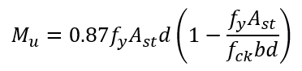
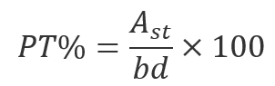

## PROCEDURE 

- Select the type of building

- Enter the length (m) in the range of 4.5 m to 8 m

- Enter the width (m) in the range of 0.9 m to 2.5 m

- Enter the floor-to-floor height (m) and then select the grade of concrete fck and grade of steel fy

- Calculate the height of each flight. Click the Submit button. After three incorrect attempts, correct formula and value will be displayed

- Click on “Next Level” to proceed to the next step

- Enter the height of riser (m) according to the type of building

- Calculate the number of risers, and after three incorrect attempts, the correct formula and value will be displayed

- Then calculate the number of treads:  
Number of treads = Number of risers – 1

- Enter the width of tread (m) as per the type of building

- Calculate Leff which is:  
Leff = Number of treads × Width of tread

- Click on “Next Level” to proceed to the next step

- Enter the modification factor (MF) value

- Calculate the effective depth d (m) for waist slab. After three incorrect attempts, the correct formula and value will be displayed

- Enter the diameter of bar (mm) to be adopted

- Choose the clear cover value (either 15 mm or 20 mm) and calculate the overall depth D

- Click on “**Next Level**” to proceed to the next step

- Enter the live load within the range of 3 kN/m to 5 kN/m and the floor finish value within the range of 1 to 2 kN/m

- Calculate the factored moment Mu. After three incorrect attempts, the correct formula and value will be displayed

- Click on “**Next Level**” to proceed to the next step

- Choose the beam thickness wall width b (mm) from the dropdown list. The effective depth is checked to ensure safety

- Calculate Ast (mm2) using appropriate design formulas

  
  
- Number of bars and spacing is calculated and the summary is displayed
- Click on “**Next Level**” to proceed to next step
- Enter the diameter to be adopted for distribution steel
- Calculate the value of Astmin. After three incorrect attempts, correct formula and value will be displayed
- Number of bars and spacing is calculated and the summary is displayed
- Click on “**Next Level**” to proceed to next step
- Calculate percentage of steel 
   
   

- Deflection check is provided to check whether the provided depth is safe in deflection

