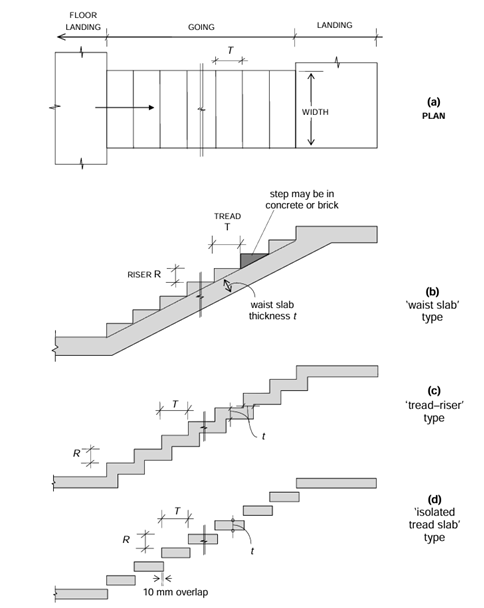
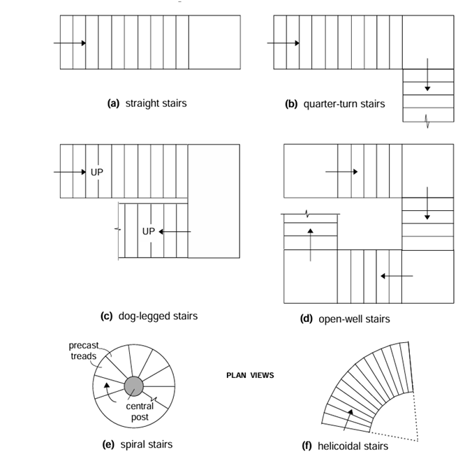

## Theory

Staircase design is a critical aspect of architectural and structural engineering, ensuring safe vertical circulation within buildings while contributing to their aesthetic appeal. The design process involves considering various factors, including building codes, safety standards, architectural style, and user comfort. It should be noted that, from a structural viewpoint, the staircase merely comprises slab/beam elements. 

1) Geometry and Usable Dimensions:

Steps: Stairs are comprised of treads (horizontal walking surface) and risers (vertical height between treads). The design considers ergonomics and user comfort. Standard building codes specify a comfortable rise and tread ratio.
Going (Run): This is the horizontal distance covered in one flight of stairs. The total going is determined by the number of risers and the desired tread size.
Landings: These are horizontal platforms provided at changes in direction or for breaks in long flights.

2) Structural Analysis:

Stair Flights: Flights typically behave as simply supported slabs spanning between landings or walls. The effective span is calculated considering the support conditions.
Bending Moments: The weight of people using the stairs and the self weight of the RC structure itself create bending moments in the stair slab. Engineers analyze these moments to determine the required reinforcement.
Landings: Landings act as supports for the stair flights and introduce hogging moments (positive bending moments) at the corners and near supports.

3) Material Properties:
Concrete Strength: The compressive strength of concrete used in the RC stair construction influences the overall load-carrying capacity.
Steel Reinforcement: Steel rebar is placed within the concrete to resist tensile forces. The design considers the yield strength and area of the steel bars.

#### TYPES OF STAIRCASES
Geometrical Configurations A wide variety of staircases are met with in practice. Some of the more common geometrical configurations are: 
- straight stairs (with or without intermediate landing
- quarter-turn stairs 
- dog-legged stairs 
- open well stairs 
- spiral stairs 
- helicoidal stairs 

#### Design Steps:

#### Define Design Parameters:
Specify the floor-to-floor height difference to be traversed by the staircase.
Determine the available space for the staircase layout.
Choose design values for concrete strength (fck) and steel yield strength (fy) based on material specifications and code requirements.
Refer to building codes for minimum live load requirements for stairs.

#### Staircase Geometry:
Based on the available space and floor-to-floor height, calculate the required number of flights and landings.
Following building code guidelines, determine comfortable tread width and riser height dimensions.
Sketch the plan and elevation of the staircase layout with all dimensions specified.

#### Structural Analysis:
Identify critical sections of the stair flight and landing for analysis (typically mid-span and support regions).
Calculate the effective span of the stair flight considering the support conditions (walls, beams).
Analyse the loads acting on the stairs (dead weight of concrete and imposed live load).
Determine the bending moments and shear forces acting on the critical sections using engineering mechanics principles.

#### Reinforcement Design:
Based on the bending moments and code provisions, calculate the required area of steel reinforcement (Asc) for the stair flight and landing.
Select appropriate bar diameter and spacing for the longitudinal and transverse reinforcement.
Ensure proper concrete cover thickness for durability as specified by building codes.

#### Serviceability Check (Optional):
Depending on the code and project requirements, perform calculations to ensure the staircase deflection under service loads is within acceptable limits for user comfort.

#### Detailing and Drawings:
Prepare detailed drawings of the staircase layout, including dimensions, reinforcement details (bar diameter, spacing, placement), and concrete cover requirements.
Specify notes on concrete mix design, construction sequence, and any special requirements.

#### Code Requirements:
Building codes specify minimum live loads (occupancy loads) for stairs to ensure safety.
Additional considerations are made for seismic zones, where earthquake forces need to be factored into the design.
